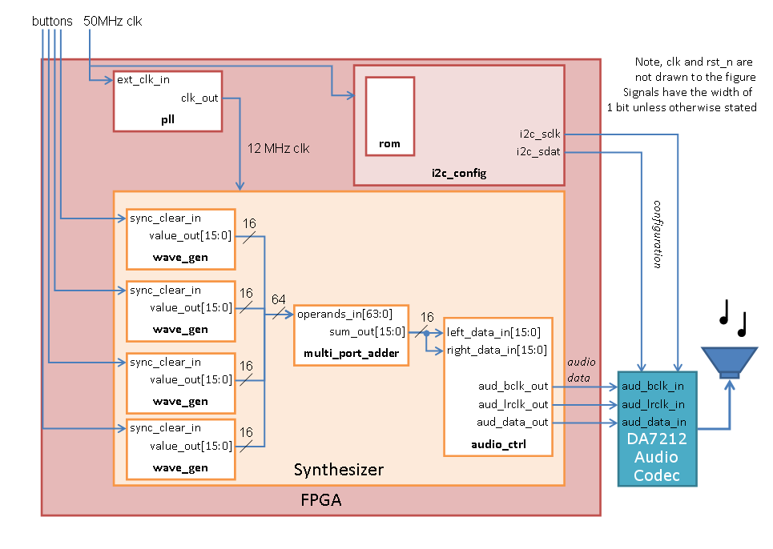

# AudioSynthesizer

## About

Audio synthesizer project to understand logic synthesis using VHDL. This is a fully functioning audio synthesizer that can be put into an FPGA. It is configured to be operated with 4 buttons and 1 switch. The switch is used to reset the audio synthesizer. Each button is connected to a wave generator. Wave generators can be configured with different parameters in VHDL to produce different kind of sounds. Essentially when a button is pressed and reset is lifted, a sound will be produced as the ultimate output. Also, 4 LEDs on the PYNQ-Z1 development board will light up when I2C block has transmitted all of the necessary configuration values from ROM. Files for some testbenches and audio codec model are there only for verification and simulation purposes. 

https://github.com/user-attachments/assets/6c46307f-5855-40c4-97d4-067e06dfc58d

## Setup

- Software requirements: Project can be setup using Vivado
- Hardware requirements: PYNQ-Z1 development board, DA7212 audio codec shield and speakers

- In addition to provided source and constaint files, premade PLL block should be used in Vivado while putting it all together. I2C block operates with 50MHz clock but the synthesizer itself operates with 12MHz clock.
